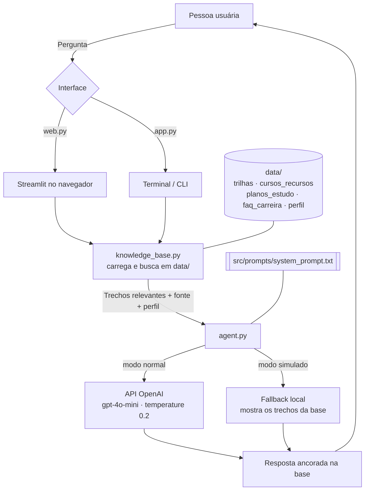

# Arquitetura do CarreiraTron

Diagrama do fluxo de uma pergunta, do terminal até a resposta.

## Componentes

| Componente | Arquivo | Papel |
|------------|---------|-------|
| Interface web | `src/web.py` | Chat em Streamlit no navegador; toggle de modo simulado |
| Interface CLI | `src/app.py` | Mesma conversa no terminal; flags `--mock` e `--ask` |
| Recuperação | `src/knowledge_base.py` | Lê `data/`, quebra em trechos com rótulo de origem, busca por palavra-chave (com peso extra para o rótulo da fonte) |
| Orquestração / Prompt | `src/agent.py` | Monta `CONTEXTO + PERFIL + PERGUNTA` e aplica o system prompt |
| LLM | OpenAI `gpt-4o-mini` | Gera a resposta (só no modo normal) |
| Base de conhecimento | `data/*.json`, `data/*.csv`, `data/*.md` | Fonte única de verdade do agente |
| Anti-alucinação | `src/prompts/system_prompt.txt` | Regras: responder só pelo contexto, citar fonte, admitir quando não sabe |

> Screenshots da aplicação em execução podem ser adicionados aqui para o README e o pitch.
