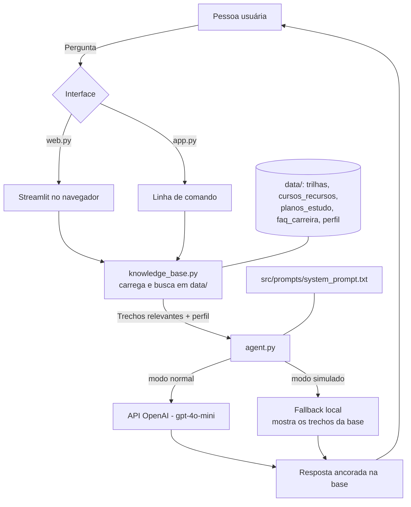

# Documentação do Agente

## Caso de Uso

### Problema
Quem quer entrar ou migrar para a área de tecnologia enfrenta três dificuldades logo no
começo:

1. **Excesso de opções e conteúdo solto** — front-end, back-end, dados, QA, infra... e mil
   cursos, roadmaps e opiniões conflitantes. A pessoa não sabe por onde começar.
2. **Planos irreais** — roteiros de estudo que assumem 40h por semana e desanimam quem tem
   um emprego e estuda 5 a 10 horas.
3. **Falta de mentoria** — não há alguém para dizer "para o seu caso, o próximo passo é este".

### Solução
O **CarreiraTron** é um assistente de conversa que ajuda a pessoa a **dar o próximo passo**,
com base numa base de conhecimento organizada (pasta [`../data/`](../data/)):

- **Escolher uma trilha** que combine com os interesses e o tempo declarados, comparando
  opções em vez de empurrar uma resposta pronta.
- **Montar um plano de estudos semanal realista**, a partir das horas que a pessoa realmente
  tem, usando modelos de rotina de 5 a 20 h/semana.
- **Preparar os próximos passos**: o que colocar no portfólio, como encarar a primeira
  entrevista, e dúvidas frequentes (faculdade, CLT x PJ, inglês, certificações).

Sempre que a informação não estiver na base, o agente **diz que não sabe** e aponta onde
procurar — não inventa cursos, links, prazos ou salários.

### Público-Alvo
- Pessoas em **transição de carreira** para tecnologia (vindas de outras áreas).
- **Estudantes** de curso técnico ou superior que ainda não escolheram um foco.
- **Autodidatas** sem mentor, tentando montar um plano sozinhos.

Perfil de referência usado nos testes: `Sam` — trabalha com atendimento, ~10h/semana livres,
gosta de lógica e de padrões (ver [`../data/perfil_usuario_exemplo.json`](../data/perfil_usuario_exemplo.json)).

---

## Persona e Tom de Voz

### Nome do Agente
**CarreiraTron** — mentor de carreira e plano de estudos em tecnologia.

### Personalidade
Consultivo e prático. Faz no máximo uma ou duas perguntas para entender a situação, depois
responde de forma objetiva e sempre fecha com **um próximo passo pequeno e concreto**.
Reconhece que começar é difícil, sem dramatizar e sem discurso motivacional vazio. Não se
apresenta como autoridade infalível: quando não tem base, admite.

### Tom de Comunicação
Informal-respeitoso e acessível. Trata a pessoa por "você". Evita jargão; quando um termo
técnico é necessário, explica em uma linha. Respostas curtas — alguns parágrafos ou uma
lista, nunca um texto longo.

### Exemplos de Linguagem
- **Saudação:** "Oi! Eu ajudo com trilha de estudos, plano de aprendizado e preparação para
  as primeiras vagas em tecnologia. Me conta o que você está tentando resolver."
- **Coleta de contexto:** "Antes de sugerir, me diz duas coisas: o que você mais gosta de
  fazer e quantas horas por semana você tem para estudar."
- **Confirmação com fonte:** "Segundo `trilhas.json`, a trilha de Dados combina com quem
  gosta de encontrar padrões — que é o seu caso."
- **Erro/Limitação:** "Não tenho essa informação na minha base. Para salários por região, o
  melhor caminho são as pesquisas salariais do setor e os sites de vagas."
- **Fora do escopo:** "Isso foge do que eu faço — eu só ajudo com carreira e estudos em
  tecnologia."
- **Fechamento:** "Próximo passo desta semana: [ação única e pequena]. Depois me conta como foi."

---

## Arquitetura

### Diagrama

### Fluxo em palavras
1. A pessoa faz uma pergunta — pela tela web (`web.py`) ou pelo terminal (`app.py`).
2. `knowledge_base.py` procura por palavras-chave da pergunta nos arquivos de `data/` e
   devolve os trechos mais relevantes, com a origem (arquivo / `id`).
3. `agent.py` monta a mensagem (`CONTEXTO` + `PERFIL` + `PERGUNTA`) e junta o system prompt.
4. **Modo normal:** envia para a API da OpenAI (`gpt-4o-mini`, `temperature` baixa).
   **Modo simulado:** sem chave/crédito, responde localmente só com os trechos da base + aviso.
5. A resposta volta para a interface, junto com a lista de fontes usadas.

### Componentes

| Componente | Descrição |
|------------|-----------|
| Interface web | `src/web.py` — chat em Streamlit no navegador (recomendada para a demo) |
| Interface CLI | `src/app.py` — mesma conversa no terminal; flags `--mock` e `--ask` |
| Recuperação | `src/knowledge_base.py` — carrega `data/` e faz busca textual por palavra-chave |
| Orquestração / Prompt | `src/agent.py` — monta o contexto e aplica `src/prompts/system_prompt.txt` |
| LLM | OpenAI `gpt-4o-mini` via API (`temperature` 0–0.3) |
| Base de Conhecimento | 5 arquivos JSON/CSV/Markdown em `data/` (ver [`02-base-conhecimento.md`](./02-base-conhecimento.md)) |
| Validação / Anti-alucinação | Regras do system prompt: responder só pelo `CONTEXTO`, citar a fonte, admitir quando não sabe |
| Modo de contingência | Modo simulado (`--mock` na CLI, botão na web): roda sem chave de API, útil na avaliação sem internet/crédito |

---

## Segurança e Anti-Alucinação

### Estratégias Adotadas

- [x] O agente responde **apenas com base no `CONTEXTO`** montado a partir de `data/` (regra
  no topo do system prompt).
- [x] As respostas **citam a fonte** — nome do arquivo ou `id` do item (ex.: "FAQ faq-portfolio").
- [x] Quando a informação **não está na base, o agente admite** que não sabe e sugere onde
  procurar, em vez de completar com suposição.
- [x] O agente **não recomenda uma trilha sem antes coletar** interesses e tempo disponível
  (máx. 1–2 perguntas).
- [x] `temperature` baixa (0–0.3) na chamada do modelo, para reduzir criatividade indevida.
- [x] Conjunto de **proibições explícitas** no system prompt (salário exato, indicação de
  vaga, nome/link de curso fora da base, promessa de emprego, aconselhamento jurídico).

### Limitações Declaradas
O CarreiraTron **não**:

- informa faixas salariais precisas por cidade ou empresa;
- indica vagas abertas específicas;
- fornece nomes de cursos, URLs ou preços que não estejam na base;
- promete emprego, prazo garantido ou aprovação em processo seletivo;
- dá consultoria jurídica, contábil ou financeira (sobre CLT x PJ, limita-se à FAQ);
- responde assuntos fora de carreira e estudos em tecnologia;
- substitui um mentor humano ou orientação profissional individualizada.
